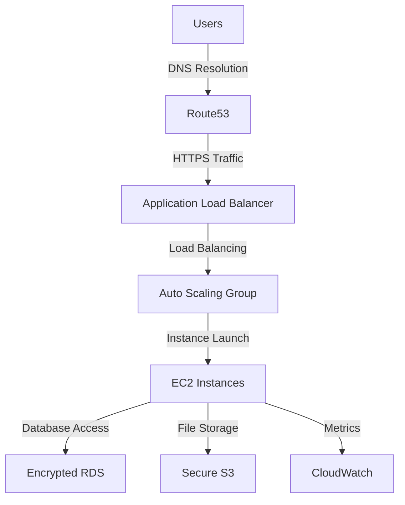

# 🚀 Welcome to My Cloud Odyssey! - Yash Saraf 🌌

**Embark on a journey through my CSYE6225 Cloud Architecture masterpiece!** Built at Northeastern University, this project is a testament to scalable, secure, and automated cloud innovation on AWS. Buckle up for a cosmic tour of code, infrastructure, and creativity!

---

## 🌍 Galactic Blueprint: Project Highlights

### 🌠 Stellar Architecture
- **Visualize the Cosmos**: [Check out the Cloud Architecture Diagram](#)
- 

### 🌩️ Nebula of Innovation
- **Webapp**: A Node.js-powered REST API galaxy, orbiting with:  
  - Secure S3 file uploads guarded by IAM roles.  
  - Automated deployments via GitHub Actions.  
  - CloudWatch logging for real-time insights.  
- **Terraform-IAC**: My infrastructure constellation, crafted with:  
  - Multi-AZ VPCs and NAT Gateways.  
  - Auto Scaling Groups for dynamic scaling.  
  - KMS-encrypted RDS and S3 storage.  
- **Serverless**: A nascent star cluster with Node.js Lambda potential (work in progress).

### 🔒 Fortress of Security
- **KMS Encryption**: Shields EBS, RDS, and S3 with unbreakable keys.  
- **Secrets Manager**: Safeguards credentials in a digital vault.  
- **CloudWatch**: Monitors the universe with dashboards and alarms.

---

## 💫 Tech Constellation
🌟 **AWS Ecosystem**: EC2, S3, RDS, Lambda, ALB, VPC  
🌟 **Node.js**: 18.x - The engine of my webapp  
🌟 **Terraform**: 1.5.x - Shaping the cloud terrain  
🌟 **Packer**: Crafting AMIs with precision  
🌟 **MySQL**: 8.x - Powering the data core  
🌟 **GitHub Actions**: Automating the cosmos  

---

## 🌠 Data Flow Voyage

---

## 🎓 Academic Meteor Shower
Forged in the fires of **CSYE6225 - Network Structures & Cloud Computing**, this project ignites:  
- 🌩️ Multi-AZ scalability across US-East-1.  
- 🛠️ Infrastructure as Code mastery.  
- 🚀 CI/CD automation with GitHub Actions.  
- 🛡️ Security fortresses with KMS and Secrets Manager.

---

## 📜 Cosmic License
MIT License - Explore the stars! [See LICENSE](https://github.com/yourusername/.github/blob/main/LICENSE)  

---

## 🌐 Portals to My Universe
- **Contact Me**: saraf.y@northeastern.edu  
- **LinkedIn**: www.linkedin.com/in/iyashsaraf  
- **GitHub Hub**: https://github.com/iyashsaraf  
